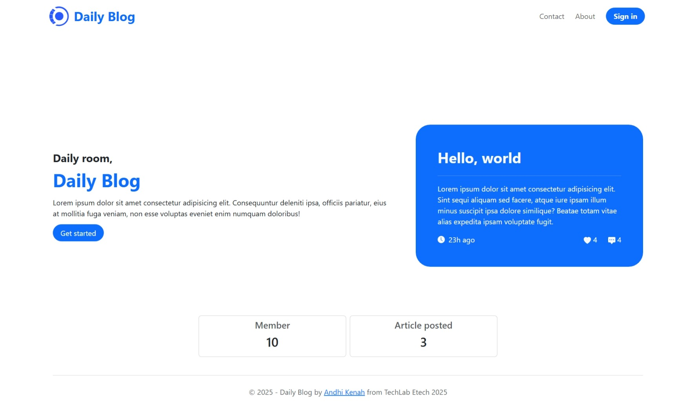
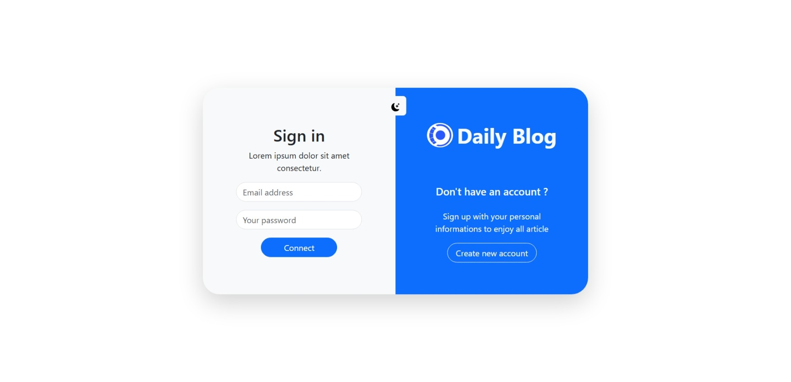
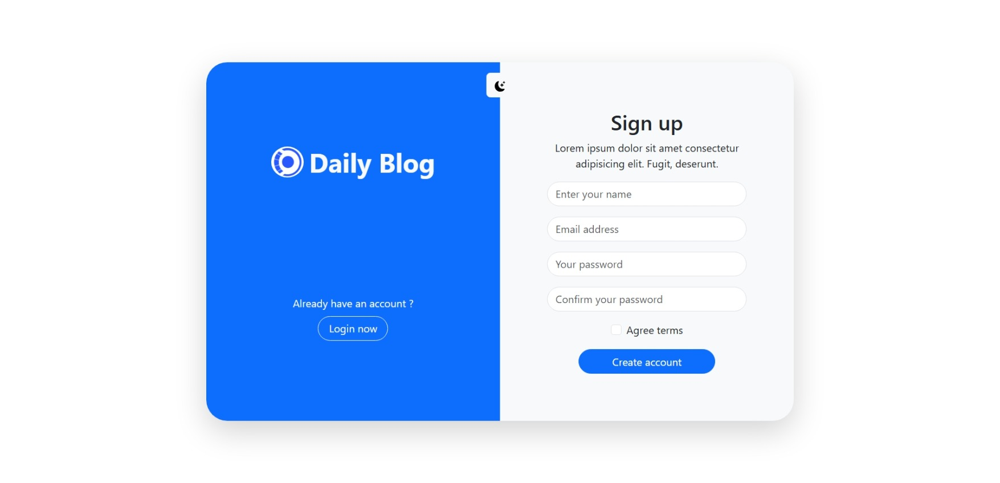
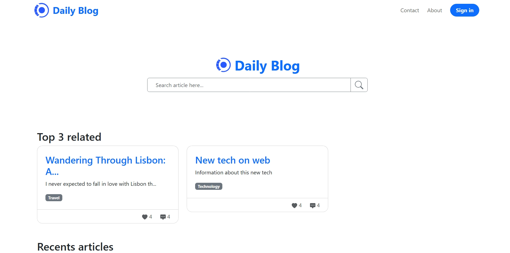
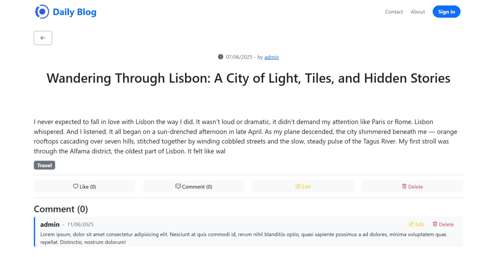
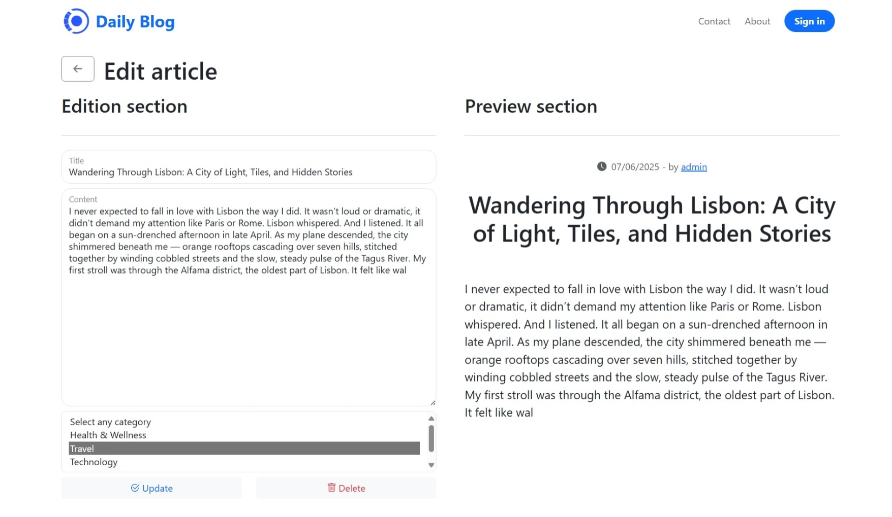
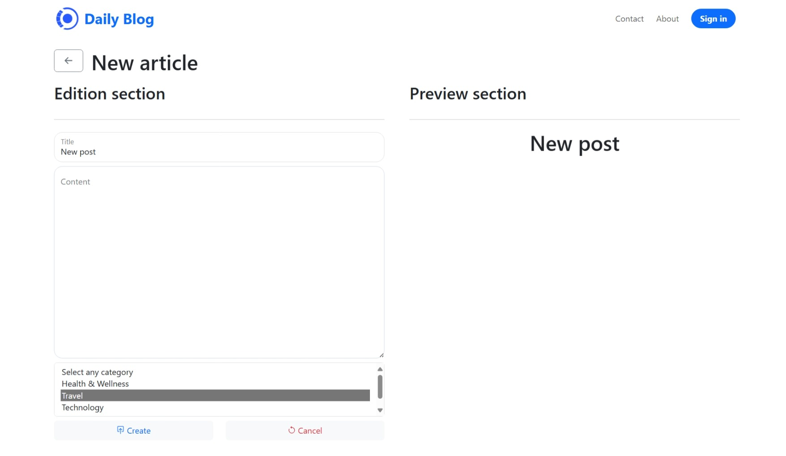

# Mon Blog

Bienvenue sur **Daily Blog** sur BLOG-Andhi !  
Ce projet a été réalisé dans le cadre d'un techlab organisé par **Etech**. **Daily Blog** est une application web créé avec PHP Symfony qui permet de ***publier***, ***lire*** et ***gérer*** des articles via une interface reactive et moderne.

## Capture d'écran
<table>
  <tr>
    <th>Accueil du blog</th>
    <th>Page de connexion</th>
    <th>Page d'inscription</th>
  </tr>
  <tr>
    <td align="center">
      
    </td>
    <td align="center">
      
    </td>
    <td align="center">
      
    </td>
  </tr>
</table>

<table>
  <tr>
    <th>Liste des article</th>
    <th>Détail d'un article</th>
    <th>Modification et Création</th>
  </tr>
  <tr>
    <td align="center">
      
    </td>
    <td align="center">
      
    </td>
    <td align="center">
      
       
      
    </td>
  </tr>
</table>

## Fonctionnalités

- Création et affichage d'articles de blog
- Gestion de catégorie d'articles
- Commentaire interactive
- Interface utilisateur simple

## Technologies utilisées

- **Backend** : PHP 8+ avec [Symfony](https://symfony.com/)
- **Templating** : [Twig](https://twig.symfony.com/)
- **Frontend** : [ReactJS](https://react.dev/)
- **Lib** : [Bootstrap](https://react-bootstrap.github.io/)
- **Base de données** : [MySQL](https://mysql.com/)
